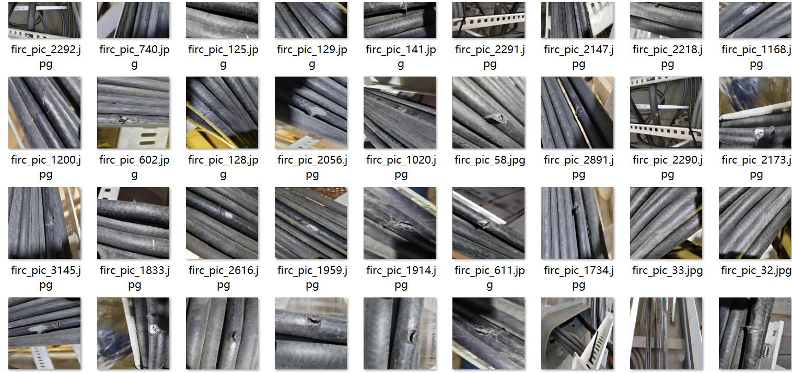
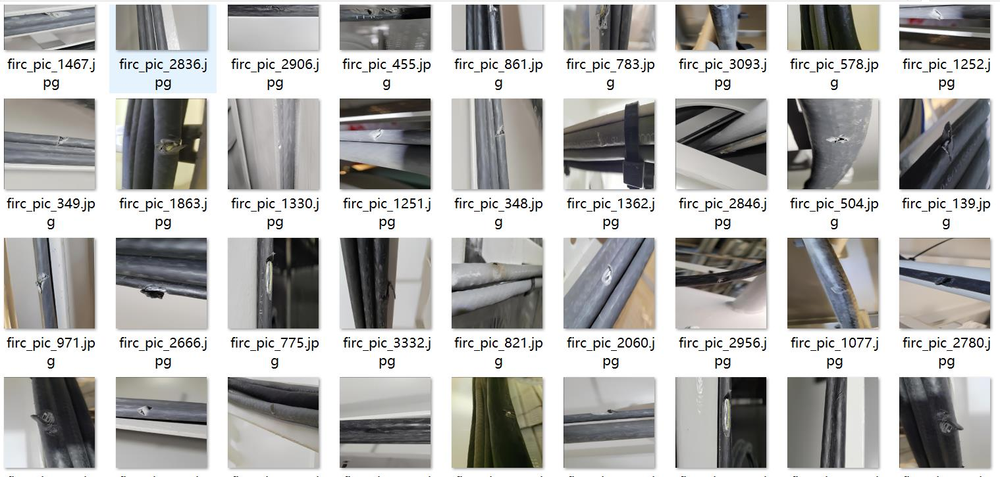
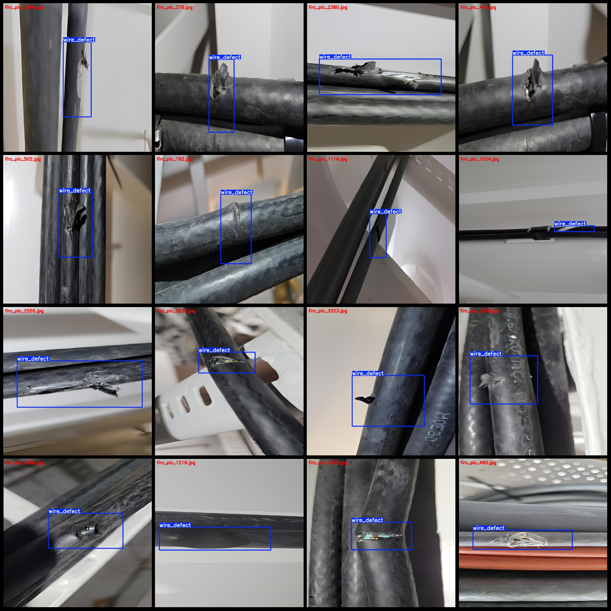
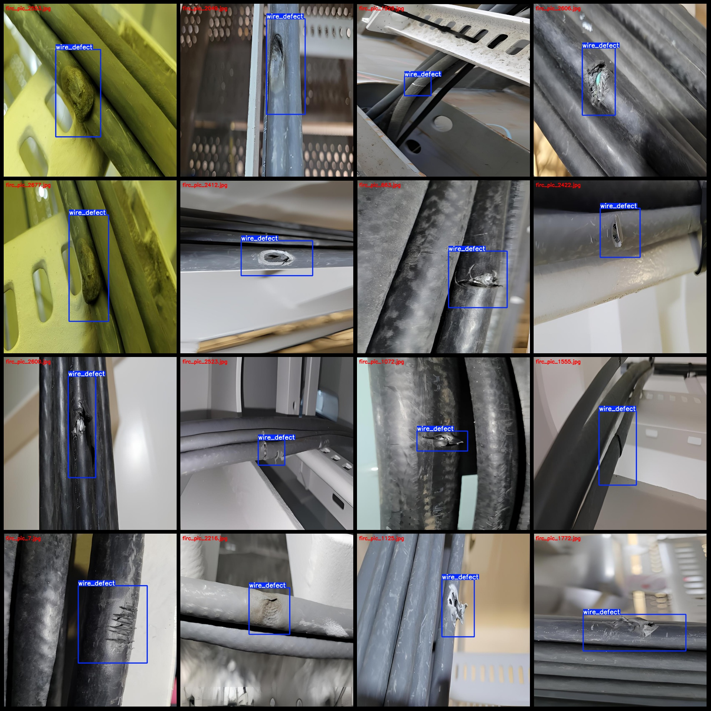

# Cable Inspection Data for Faulted Conductor with Degraded Insulation - VOC+YOLO Format - 3346 Images in 1 Category

Dataset format: Pascal VOC format + YOLO format (without split path in txtfile, only contain jpg image and corresponding VOC format xml file and yolo format txt file)
number of images: 3346
The number of XML files is 3346.
The number of txt files is 3346.
annotationnumber of classes: 1
annotation class names:["wire_defect"]
The number of boxes labeled in each category:
Wire defect count = 3346
Total frames: 3346
The number of images in each category:
Wire defect count = 3346
image resolution: 832x832
LabelImg is a Python library for annotation and manipulation of images. It provides functions to add labels, annotations, and other metadata to an image.

Here's an example of how to use LabelImg to add labels to an image:

```python
import labelImg
from PIL import Image

# Open the image file
image = Image.open('example.jpg')

# Create a new labeling object
labelImg.Label(image)

# Add labels to the image
labelImg.add_labels(image, ['cat', 'dog'])

# Save the modified image
labelImg.save('modified_example.jpg')
```

In this example, we first open the image using PIL (Python Imaging Library). Then, we create a new labeling object using `LabelImg.Label()`. We can specify the image to which the labels will be added using `LabelImg.add_labels()`. Finally, we save the modified image using `LabelImg.save()`.
Annotation rule: Draw a rectangle around the class.

```markdown
- category names
- class description
    - attribute list
        - attribute item 1
            - attribute value 1
            - attribute value 2
        - attribute item 2
            - attribute value 1
            - attribute value 2
            - ...
- Example
```
Important Note: The dataset does not have a separate training, validation, and test set to be divided.
Special Statement: This dataset does not guarantee the accuracy of the trained model or weight file.
Image Preview:
## Images






Here is a pay link on Stripe ( https://buy.stripe.com/3cs8yP7sY87d0vu9AB ). Please contact me lonlonago@foxmail.com after funding $89, and I will send you a complete data files , thank you!

